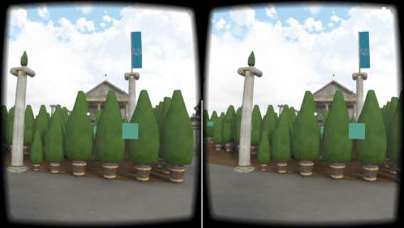
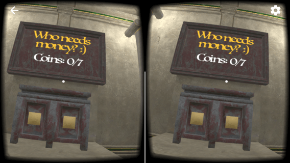

# A Maze
Starter project for the Udacity [VR Developer Nanodegree](http://udacity.com/vr) program.

- Course: VR Software Development
- Project: A Maze

### Specifications
- Description: A maze build on walls... and trees
- Scene used: main.scene
- Unity Version: [Unity LTS Release 2017.4.4f1](https://unity3d.com/unity/qa/lts-releases?version=2017.4)
- [GVR SDK for Unity v1.100.1](https://github.com/googlevr/gvr-unity-sdk/releases/tag/v1.100.1)
- Compatible with iOS and Android

### Extras
- Added initial signpost with UI
- Added Luminari font text to add more consistency to the labyrinth design
- Added 7 hidden coins
- Added a score based on quantity of collected coins
- Added a soil texture under the central tree mini maze
- Added a commentary phrase panel at final signpost with seven differente messagens, each one depending on the number of collected coins
- Changed the door locked audio to a tone sample (The original locked door audio file has a low volume).

### Audio Credits
- Audio ambience: [North Wood Forest in Late Winter, afternoon, cloudy, cold air rumble, some wind rustle in frozen trees, crows calls, birds tweets and chirps, wildlife includes: American Crows, Common Raven, Black-Capped Chickadee](https://www.zapsplat.com/music/north-wood-forest-in-late-winter-afternoon-cloudy-cold-air-rumble-some-wind-rustle-in-frozen-trees-crows-calls-birds-tweets-and-chirps-wildlife-includes-american-crows-common-raven-black-cap/) - Author: [Articulated](https://www.zapsplat.com/author/articulated/) - Standard Licence
- Tone sound for locked door: [A Tone](http://soundbible.com/1815-A-Tone.html) - Author: His Self - Public Domain

### Screenshots

